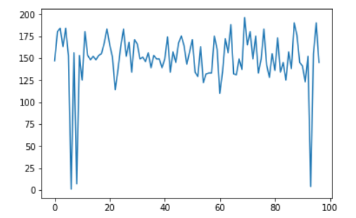
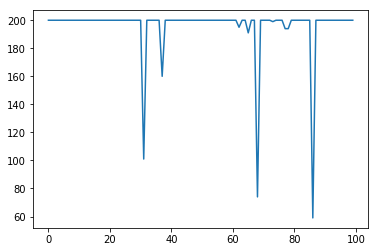

# Performance of different algorithms with cart pole game
===================

- - - - 

# Overview #
These are the results obtained with different algorithms. The result can still be improved for alogithms by playing with the hyperparameters. Hyperparameters play a very important role in training. Even the loss function can change the convergence rate of model. Just by changing the loss function from root mean squared error to mean squared error, DQN's average reward increased. 

# DQN #

)

# Duel-DQN #

# Policy Gradient #

